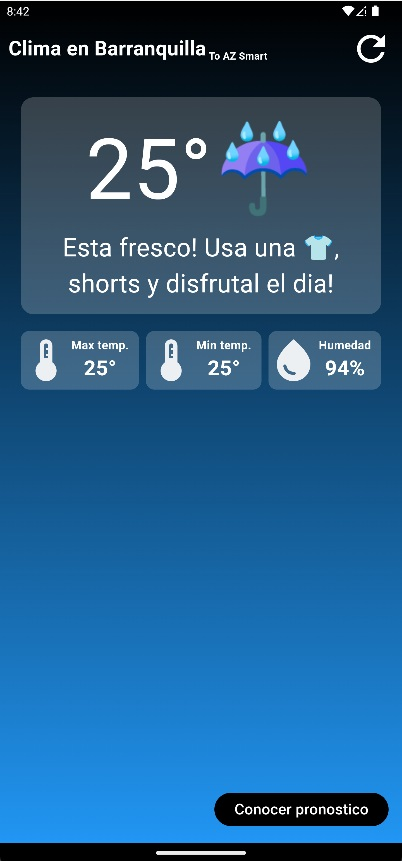
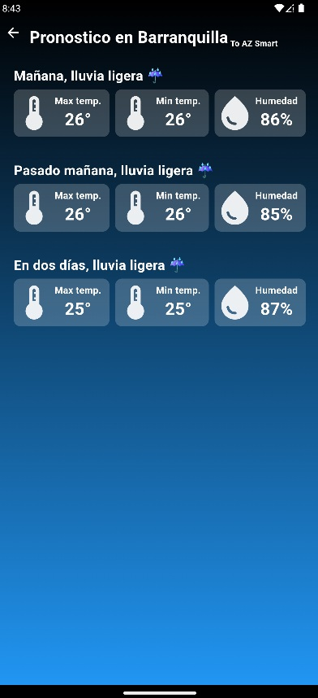

# az_weather_app

Prueba técnica para la posición de Desarrollador Móvil Jr.

## Información de la prueba

Esta prueba fue desarrollada por Kevin Salcedo Medina, utilizando `Navigator`, `Location`, `http` y `flutter_spinkit` para animaciones.

## Funcionalidades del proyecto

- **Loading Screen**: Pantalla inicial que muestra una breve animación mientras se realiza la petición de información del clima de la ubicación en la que se encuentra el dispositivo. En esta pantalla también se solicitan los permisos necesarios para el correcto uso de la aplicación.

- **Home Screen**: Primera pantalla donde se muestra la información del clima del día actual.

- **Forecast Screen**: Pantalla que muestra el pronóstico para los próximos 3 días en la ubicación del dispositivo. Se utilizó la API de "Call 5 day / 3 hour forecast data" de OpenWeather, ya que era la única opción de pronósticos gratuita disponible. Ten en cuenta que los datos obtenidos pueden no ser precisos.

## API Key

La prueba incluye mi API key personal para facilitar las pruebas. Por favor, asegúrate de no compartirla públicamente.

## Instalación

1. Clona el repositorio:
   ```bash
   git clone https://github.com/tu_usuario/az_weather_app.git
2. Navega al directorio del proyecto:
    ```bash
    cd az_weather_app
3. Instala las dependencias:
    ```bash
    flutter pub get
4. Ejecuta la aplicación:
    ```bash
    flutter run

## Capturas de pantalla

### Home Screen


### Forecast Screen
